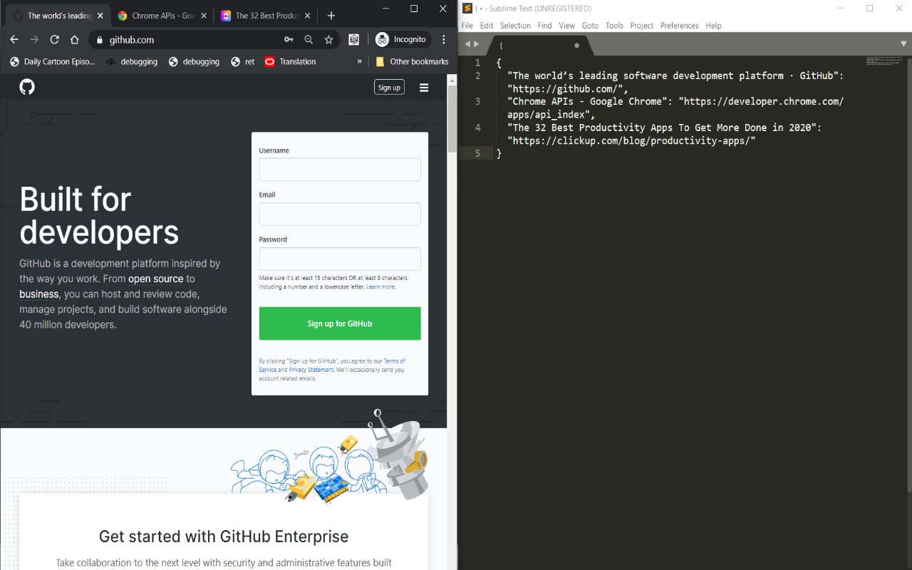

[Chrome extension link](https://chrome.google.com/webstore/detail/gofetchmylinks/bkabeofnoihnlfmihifdbagohgbmmndo)
I wrote this at a time when I used to open 50 tabs at once, and wasn't aware of the 'save my browser session' feature most browsers have. I couldn't shut down the browser with all those tabs open, unless I manually copied each and every one to my text editor to save them. So I wrote this to aggregate all tab urls, and I suppose it can be useful for developers.

